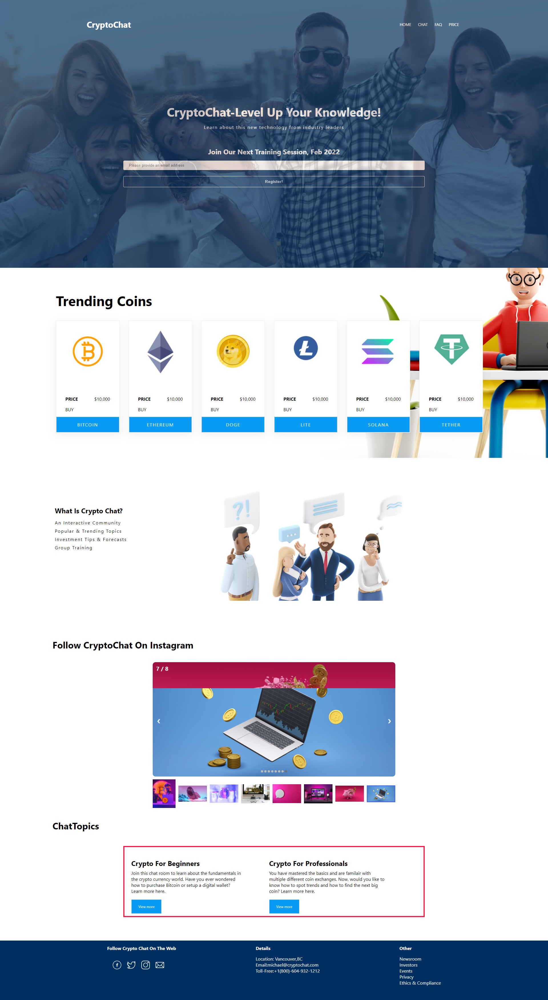
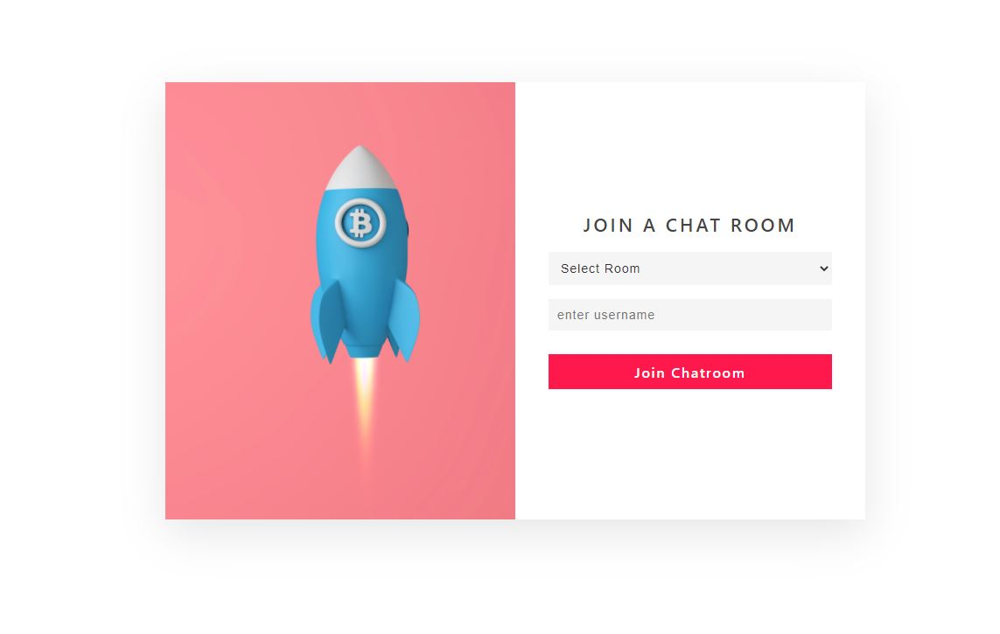
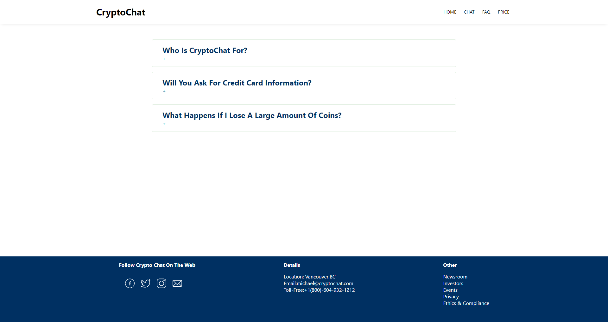
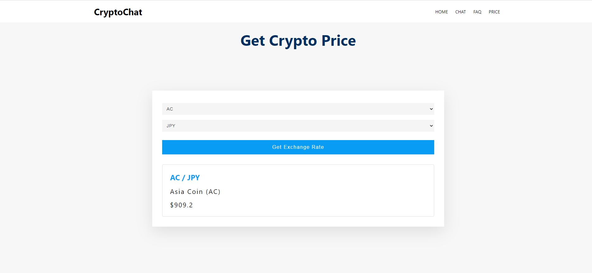

**Technologies Used**:

1. React JS
2. Node
   3.Express
   4.SASS
   5.Web Sockets
3. Multiple Packages
   -AOS (Animation)
   -React Toastify
   -React Carousel Minimal
   -React Router Dom

APIS's Used:

1. Created a Rest API to fetch crypto topics
2. Crypto Compare for the different coin prices (https://min-api.cryptocompare.com/)

**HOW TO INSTALL**

### `Server`

```terminal
$ cd server // go to the server directory
$ npm i // install packages
$ npm start // run the server
```

### `Client`

```terminal
$ cd client // go to the client directory
$ npm i // install packages
$ npm start // run the client
```

**FEATURES**
CryptoChat allows usrs to pick one of two different chat rooms (beginner + professional) and the objective is to learn and build upon their knowledge.

On the website there is also a pricing feature where users can go in and check the prices of different coins and see their value in different countries (United States, Canada, Austraila, Great Britian, Switzerland, Russia + more.)

For frequently asked questions, visitors can go to the FAQ page.

**Lessons Learned**

What I have learned from this project is to always have a backup plan. When something does not go right or is unavailable you should be able to pivot quickly. In my scenario, I assumed my first API would work no problem and would display all of the information but this was not the case. This lead me to change up my pages, and change them again once I found a different API.

Secondly, another lesson I learned was to be more decisive. When looking to add a chat functionality I spent too much time lloking into other options beside what was recommended to me in the beginning. If I were to of done this from the very start, I could of had a more polished finish version.

Lastly a another lesson I learned was to be more cautious with the time I have and under estimating how long it will take to work on a specific feature. I had multiple features that took an extra 3-4 hours each than what was anticipated.

**SCREEN SHOTS**





```

```
